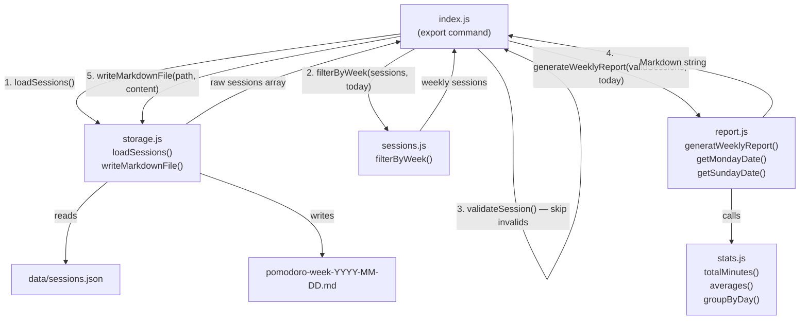

# Design Document: Weekly Report Export

## Overview

The `weekly-report-export` feature adds a `pomodoro export` CLI command that generates a Markdown file summarising the current week's focus sessions. The output includes a daily breakdown of sessions with descriptions and durations, overall totals, and the average session duration.

The design follows the existing module boundary rules strictly:

- A new **`src/report.js`** module contains all Markdown formatting as pure functions.
- **`src/storage.js`** gains a `writeMarkdownFile` function for the file-write I/O step.
- **`src/index.js`** wires the new `export` command using the existing Commander.js pattern.
- **`src/sessions.js`** and **`src/stats.js`** are consumed as-is — no changes needed.

The feature introduces no new data model fields and no new persistent state. It is purely a read-and-format pipeline.

---

## Architecture



The data flow is linear and stateless: load → filter → validate → format → write. Each step is handled by a dedicated module with no cross-cutting concerns.

---

## Components and Interfaces

### `src/report.js` (new)

Pure formatting module. No imports from `storage.js` or `index.js`.

```js
/**
 * Returns the YYYY-MM-DD date string of the Monday of the ISO week
 * containing the given referenceDate string.
 */
export function getMondayDate(referenceDate: string): string

/**
 * Returns the YYYY-MM-DD date string of the Sunday of the ISO week
 * containing the given referenceDate string.
 */
export function getSundayDate(referenceDate: string): string

/**
 * Generates a Markdown-formatted weekly report string from a sessions array
 * and a reference date string (YYYY-MM-DD). Returns a no-sessions message
 * when the array is empty.
 */
export function generateWeeklyReport(sessions: Session[], referenceDate: string): string
```

Internal helpers (not exported):

- `buildSummarySection(sessions)` — produces the `## Summary` block using `totalMinutes`, `averageDuration` from `stats.js`.
- `buildDailyBreakdown(sessions)` — produces the `## Daily Breakdown` block using `groupByDay` from `stats.js`, sorting days and sorting sessions within each day by `startTime`.
- `roundHalfUp(value)` — applies half-up rounding (distinct from JavaScript's `Math.round` which uses "round half to even" for negative numbers; for positive minutes this is equivalent, but the intent is made explicit).

### `src/storage.js` (extended)

One new export added. No changes to existing functions.

```js
/**
 * Writes a Markdown string to the given file path, creating parent
 * directories if necessary. Throws an error if path or content is
 * null/empty, or if the write operation fails.
 */
export function writeMarkdownFile(filePath: string, content: string): void
```

Implementation notes:
- Uses `fs.mkdirSync(dir, { recursive: true })` to ensure the directory exists.
- Uses `fs.writeFileSync` (overwrite semantics by default).
- Validates `filePath` and `content` before any filesystem call; throws descriptively if either is null, empty, or whitespace-only.
- Error thrown on write failure includes both the target path and the original system error message.

### `src/index.js` (extended)

New Commander.js command wired alongside the existing commands.

```js
program
  .command('export')
  .description('Export this week\'s focus sessions as a Markdown report')
  .option('-o, --output <path>', 'Output file path')
  .action(exportAction)
```

`exportAction` logic (in pseudocode, all error handling omitted for brevity):

```
1. Validate --output value: if present and blank → stderr + exit(1)
2. sessions = loadSessions()
3. today = current date as YYYY-MM-DD
4. weekSessions = filterByWeek(sessions, today)
5. validSessions = weekSessions.filter(validateSession)
   → for each skipped session: console.warn to stderr with session.id
6. markdown = generateWeeklyReport(validSessions, today)
7. outputPath = options.output ?? defaultPath(today)
   where defaultPath = path.resolve(`./pomodoro-week-${getMondayDate(today)}.md`)
8. writeMarkdownFile(outputPath, markdown)
9. console.log confirmation with path.resolve(outputPath)
```

---

## Data Models

### Session (existing, unchanged)

```json
{
  "id": "uuid-v4",
  "description": "Working on feature X",
  "duration": 25,
  "startTime": "2026-10-02T09:00:00.000Z",
  "date": "2026-10-02",
  "completed": true
}
```

- `duration` — integer minutes, 1–120 inclusive.
- `date` — `YYYY-MM-DD`, the calendar date the session was logged.
- `startTime` — ISO 8601 UTC; used only for ordering sessions within a day.

### Markdown Output Format

```markdown
# Weekly Focus Report: 2026-09-28 – 2026-10-04

## Summary

- **Total focus time:** 75 min
- **Total sessions:** 3
- **Average session duration:** 25 min

## Daily Breakdown

### 2026-09-28

- Deep work on API design — 30 min
- Code review — 20 min

### 2026-10-01

- Writing tests — 25 min
```

Empty-week format:

```markdown
# Weekly Focus Report: 2026-09-28 – 2026-10-04

No sessions were logged for this week.
```

### Week Boundary Computation

`getMondayDate(referenceDate)` reuses the same UTC arithmetic already in `filterByWeek` from `sessions.js`:

```
day = referenceDate.getUTCDay()   // 0=Sun, 1=Mon … 6=Sat
diffToMonday = day === 0 ? -6 : 1 - day
monday = referenceDate + diffToMonday days
sunday = monday + 6 days
```

This ensures consistency: `filterByWeek` and `report.js` compute the same Monday for any given date.

---

## Correctness Properties

*A property is a characteristic or behavior that should hold true across all valid executions of a system — essentially, a formal statement about what the system should do. Properties serve as the bridge between human-readable specifications and machine-verifiable correctness guarantees.*

### Property 1: H1 heading encodes the correct week range

*For any* valid `YYYY-MM-DD` reference date and any array of sessions (including empty), the first line of the string returned by `generateWeeklyReport` SHALL be an H1 heading of the form `# Weekly Focus Report: <monday> – <sunday>`, where `<monday>` is `getMondayDate(referenceDate)` and `<sunday>` is `getSundayDate(referenceDate)`.

**Validates: Requirements 2.1, 6.2**

---

### Property 2: Summary section correctness

*For any* non-empty array of valid sessions and any reference date, the Markdown string returned by `generateWeeklyReport` SHALL contain a `## Summary` section that includes a total focus time equal to `totalMinutes(sessions)`, a total session count equal to `sessions.length`, and an average session duration equal to `Math.round(totalMinutes(sessions) / sessions.length)` (half-up rounding for positive integers).

**Validates: Requirements 2.2, 2.3**

---

### Property 3: Daily breakdown structure and ordering

*For any* array of valid sessions spanning one or more dates and any reference date, the Markdown string SHALL contain a `## Daily Breakdown` section where: (a) every date that has at least one session appears as an `### <YYYY-MM-DD>` heading, (b) no heading appears for a date with no sessions, and (c) the headings appear in strictly ascending alphabetical (and therefore chronological) order.

**Validates: Requirements 2.4, 2.6**

---

### Property 4: Session ordering within a day by startTime

*For any* day that contains two or more sessions, the sessions SHALL appear in the Markdown output in ascending order of their `startTime` ISO string, such that for any two adjacent rendered sessions A and B within the same day section, `A.startTime <= B.startTime`.

**Validates: Requirements 2.5**

---

### Property 5: Determinism

*For any* array of sessions and any reference date, calling `generateWeeklyReport(sessions, referenceDate)` multiple times SHALL return the exact same string on every invocation.

**Validates: Requirements 3.2**

---

### Property 6: Session data inclusion round-trip

*For any* non-empty array of valid sessions, every session's `description` and `duration` (formatted as `<duration> min`) SHALL appear as a substring of the Markdown string returned by `generateWeeklyReport`. That is, both values are recoverable by string search from the output.

**Validates: Requirements 3.3**

---

### Property 7: writeMarkdownFile rejects invalid arguments

*For any* call to `writeMarkdownFile` where `filePath` is null, undefined, or a whitespace-only string, OR where `content` is null, undefined, or an empty string, the function SHALL throw an error without performing any filesystem operation.

**Validates: Requirements 4.5, 5.1**

---

### Property 8: Invalid sessions excluded, valid sessions included

*For any* mixed array containing both valid sessions (duration 1–120 integer, non-empty description) and invalid sessions (any other shape), the Markdown output SHALL contain the description and duration of every valid session and SHALL NOT contain any content derived from an invalid session's `id`, `description`, or `duration` that does not coincidentally appear in a valid session.

**Validates: Requirements 5.3**

---

### Property 9: getMondayDate correctness and idempotence

*For any* valid `YYYY-MM-DD` date string `d`, `getMondayDate(d)` SHALL return a date whose `getUTCDay()` is `1` (Monday), which is within the range `[d - 6 days, d]`, and such that `getMondayDate(getMondayDate(d)) === getMondayDate(d)` (idempotent).

**Validates: Requirements 6.2**

---

## Error Handling

| Scenario | Handler | Output |
|---|---|---|
| `--output` is blank or whitespace | `exportAction` (CLI) | `console.error` with message, `process.exit(1)` |
| Session file missing / parse error | `loadSessions` (existing) | throws; `exportAction` catches, `console.error`, `process.exit(1)` |
| Invalid session in loaded data | `exportAction` (CLI) | `console.warn` to stderr with `session.id`; session skipped; execution continues |
| All sessions invalid (none valid) | `generateWeeklyReport` | Returns empty-week Markdown (zero sessions case) |
| Target directory does not exist | `writeMarkdownFile` (storage) | Creates directory with `mkdirSync({ recursive: true })` before writing |
| File write fails (permissions, disk) | `writeMarkdownFile` (storage) | Throws `Error` with target path + system error message; `exportAction` catches, `console.error`, `process.exit(1)` |
| `writeMarkdownFile` called with null/empty arg | `writeMarkdownFile` (storage) | Throws `Error` describing invalid argument before any I/O |

All thrown errors propagate up to `exportAction`, which is the single catch boundary for the CLI layer — matching the existing pattern in `index.js`.

---

## Testing Strategy

### Unit Tests (`tests/unit/report.test.js`)

Unit tests use fixed reference dates (never `new Date()`) and hand-crafted session arrays.

Key scenarios to cover:

- `getMondayDate` with a Monday input (identity), mid-week day, Sunday, Saturday
- `getSundayDate` with same variety of inputs
- `generateWeeklyReport` with empty sessions array → no-sessions format
- `generateWeeklyReport` with a single session → H1, Summary, one daily section
- `generateWeeklyReport` with multiple sessions on the same day → correct sort order
- `generateWeeklyReport` with sessions on multiple days → correct ascending day order
- Average duration rounding: fractional average that rounds up (e.g., 3 sessions totalling 100 min → 33 min average)
- Session format: `- <description> — <duration> min` exact format verified

Unit tests for `writeMarkdownFile` (`tests/unit/storage.test.js` addition):

- Throws on null `filePath`
- Throws on empty string `filePath`
- Throws on whitespace-only `filePath`
- Throws on null `content`
- Throws on empty string `content`
- Writes to a temp path and verifies content (uses `os.tmpdir()`)

### Property-Based Tests (`tests/property/report.property.test.js`)

Uses fast-check v3 with a minimum of 100 iterations per property. Fixed seed recommended for CI reproducibility.

Each test is tagged with a comment referencing the design property.

**Arbitraries needed:**

```js
// A valid session arbitrary (fixed date for determinism)
const sessionArb = fc.record({
  id: fc.uuid(),
  description: fc.string({ minLength: 1 }).map(s => s.trim()).filter(s => s.length > 0),
  duration: fc.integer({ min: 1, max: 120 }),
  startTime: fc.date({ min: new Date('2026-01-01'), max: new Date('2026-12-31') })
              .map(d => d.toISOString()),
  date: fc.constantFrom('2026-09-28', '2026-09-29', '2026-09-30', '2026-10-01',
                        '2026-10-02', '2026-10-03', '2026-10-04'),
  completed: fc.constant(true),
});

// A fixed reference date within the same week
const REFERENCE_DATE = '2026-10-01';

// An invalid session arbitrary
const invalidSessionArb = fc.oneof(
  fc.record({ id: fc.uuid(), description: fc.constant(''), duration: fc.integer({ min: 1, max: 120 }), date: fc.constant('2026-10-01'), startTime: fc.constant('2026-10-01T09:00:00.000Z'), completed: fc.constant(true) }),
  fc.record({ id: fc.uuid(), description: fc.string({ minLength: 1 }), duration: fc.integer({ min: 121, max: 999 }), date: fc.constant('2026-10-01'), startTime: fc.constant('2026-10-01T09:00:00.000Z'), completed: fc.constant(true) }),
);
```

**Property tests:**

```
// Feature: weekly-report-export, Property 1: H1 heading encodes the correct week range
test('H1 heading contains correct Monday and Sunday dates for any reference date')

// Feature: weekly-report-export, Property 2: Summary section correctness
test('Summary section contains correct total minutes, session count, and rounded average')

// Feature: weekly-report-export, Property 3: Daily breakdown structure and ordering
test('Daily breakdown contains H3 headings for all active dates in ascending order')

// Feature: weekly-report-export, Property 4: Session ordering within a day
test('Sessions within a day are rendered in ascending startTime order')

// Feature: weekly-report-export, Property 5: Determinism
test('generateWeeklyReport returns identical output on repeated calls with same inputs')

// Feature: weekly-report-export, Property 6: Session data inclusion round-trip
test('Every valid session description and duration appears in the output string')

// Feature: weekly-report-export, Property 7: writeMarkdownFile rejects invalid arguments
test('writeMarkdownFile throws for any null, empty, or whitespace filePath or content')

// Feature: weekly-report-export, Property 8: Invalid sessions excluded
test('Invalid sessions do not contribute content to the report output')

// Feature: weekly-report-export, Property 9: getMondayDate correctness and idempotence
test('getMondayDate always returns a Monday, within range, and is idempotent')
```

Each property test runs with `{ numRuns: 100 }` (fast-check default; explicit for clarity).

### Test Coverage Goals

| Module | Unit tests | Property tests |
|---|---|---|
| `report.js` — `getMondayDate` | ✓ (examples) | ✓ (Property 9) |
| `report.js` — `getSundayDate` | ✓ (examples) | implied by Property 1 |
| `report.js` — `generateWeeklyReport` | ✓ (examples + edge cases) | ✓ (Properties 1–6, 8) |
| `storage.js` — `writeMarkdownFile` | ✓ (examples + error cases) | ✓ (Property 7) |
| `index.js` — `export` command | ✓ (CLI integration examples) | — (I/O, not PBT target) |
